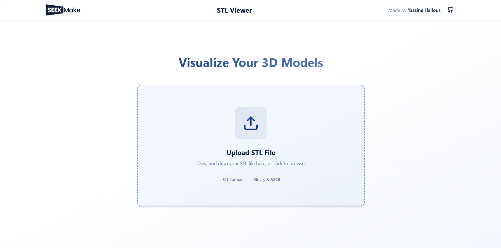
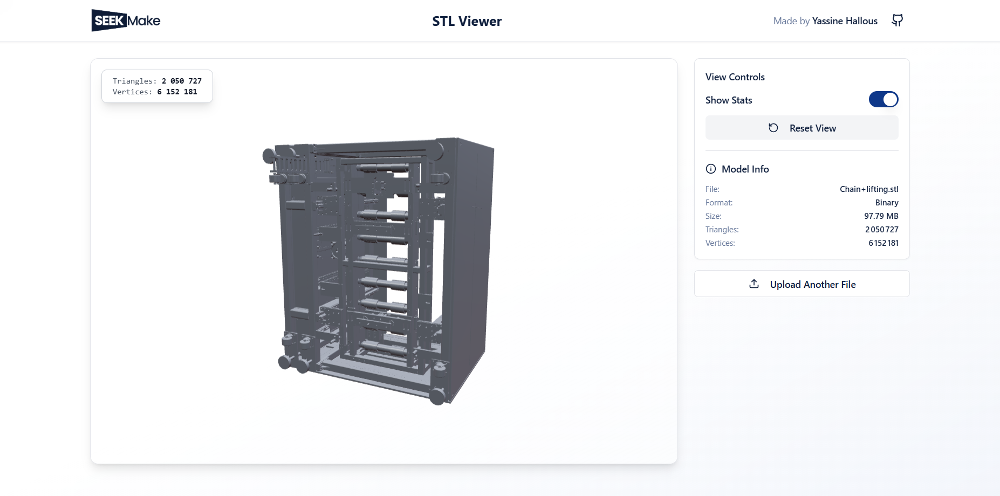

# STL Web Viewer

A lightweight 3D STL file viewer built for the SeekMake internship challenge.

## What It Does

This application loads STL files and displays them as interactive 3D models. You can rotate, zoom, and inspect your models without installing any software. It handles large files smoothly and works on both desktop and mobile devices.

## Live Demo

**Try it here:** [stl-web-viewer.vercel.app](https://stl-web-viewer.vercel.app)

**Sample files for testing:** [Google Drive](https://drive.google.com/drive/folders/1S8qYVkqxoe4rWbAVve9n6xp7Nq1uy8XW?usp=sharing)

### Screenshots

<div align="left">
  
  <p><em>Main viewer interface</em></p>
  
  
  <p><em>Control panel showing model statistics and options</em></p>
</div>

## Getting Started

Run the project on your machine:

```bash
git clone https://github.com/Hallous-Yassine/STL-WebViewer.git
cd STL-WebViewer
npm install
npm run dev
```

Open your browser to `http://localhost:8080`

## How to Use

1. Upload an STL file by clicking or dragging it into the upload area
2. Rotate the model by clicking and dragging
3. Zoom in and out using your mouse wheel
4. View model details in the side panel
5. Reset the camera view or upload a new file anytime

## Key Features

- Handles large files without freezing
- Works with ASCII and Binary STL formats
- Smooth camera controls
- Real-time statistics display
- Mobile-friendly interface
- Fast file processing

## Project Structure

The code is organized into clear sections:

- `components/` - UI elements like file uploader and controls
- `engine/` - 3D rendering logic and camera controls
- `pages/` - Main application screens
- `hooks/` - Reusable React logic
- `public/` - Web Worker for file parsing

## Built With

- React and TypeScript
- Three.js for 3D graphics
- Tailwind CSS for styling
- Vite for fast builds
- Vercel for hosting

## Technical Highlights

The app uses Web Workers to parse files in the background. This keeps the interface responsive even with large models. The 3D engine automatically positions the camera and optimizes rendering for smooth performance.

## Browser Support

Works best on modern browsers with WebGL support. Chrome, Firefox, Safari, and Edge are all supported.

## Notes

Very large files (over 100MB) may take longer to load on older devices. Mobile phones might show slower rendering for extremely detailed models.

## License

MIT License - feel free to use this code for your own projects.

---

**Created by Yassine Hallous**  
**GitHub:** [Hallous-Yassine/STL-WebViewer](https://github.com/Hallous-Yassine/STL-WebViewer)

*Built for the SeekMake internship application*
